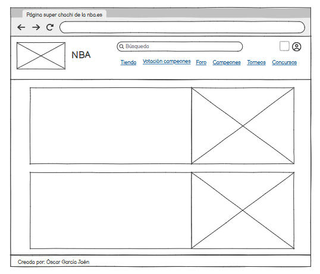
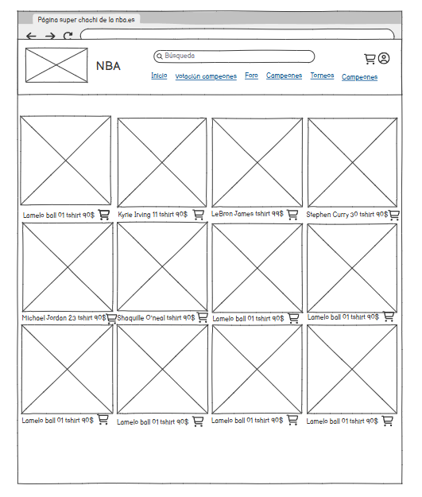
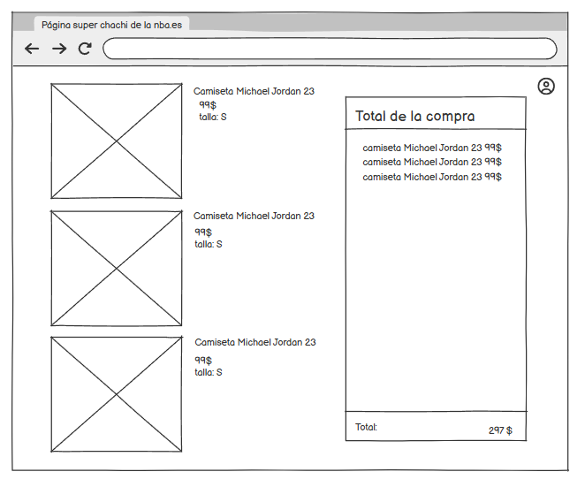
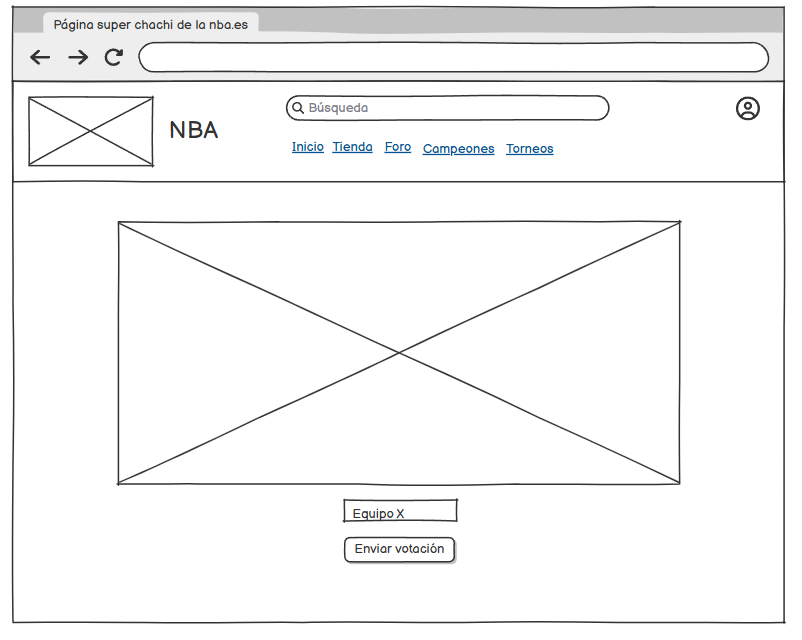
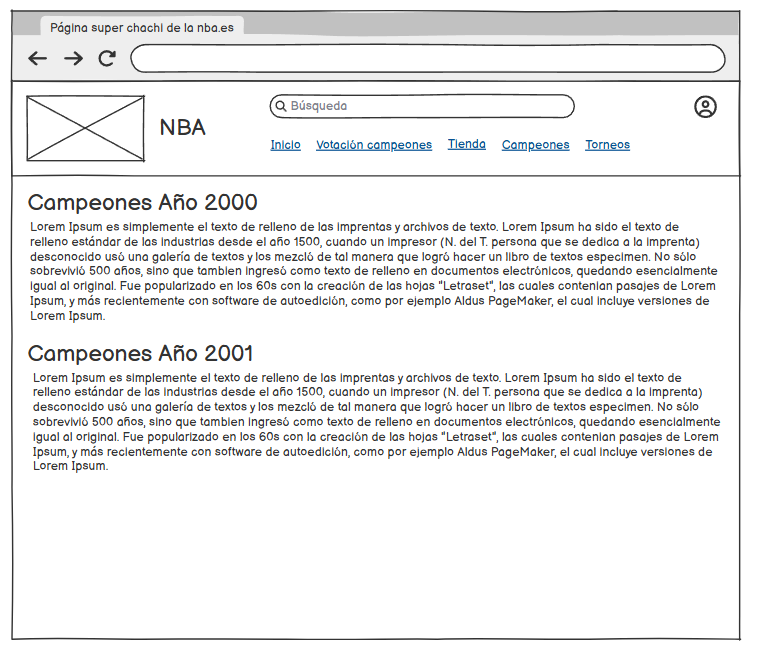
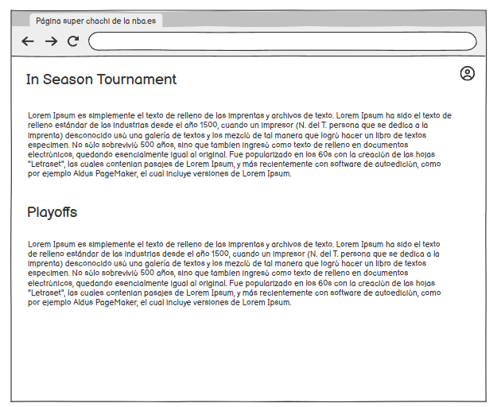
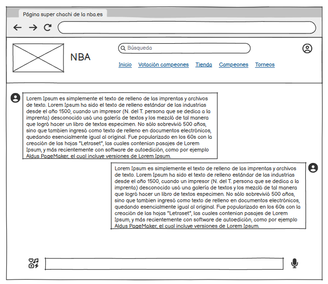

# Lenguaje-de-marcas
Proyecto 1º trimestre por **Óscar García Jaén**     

## FASE 1 PLANIFICACIÓN DEL PROYECTO: 

### Primera Página:

**Mi página de inicio cuenta con:**

Un header el cual contiene una imagen a la izquierda, que es el logo de la NBA. 
En el centro del header podemos encontrar un "buscador" y un botón para realizar la búsqueda. Situado en el lado derecho, podemos encontrarnos enlaces que nos llevan a algunas de las páginas asociadas a mi proyecto.
En la parte superior derecha podemos ver una imagen que enlaza con la página de inicio de sesión.

Un main que contiene un "h1" que contiene el título "Bienvenidos al mundo del baloncesto", justo debajo podemos encontrar un "p" que contiene un mensaje de bienvenida a mi página y por último descendiendo un poco más encontramos una foto representativa de los equipos en sus respectivos estados de EEUU.

Un footer el cual está conformado por un mensaje que indica el creador de la página web.

### Balsamiq: 

**Cambios**

Como podemos observar, el cambio está situado en el main, ya que inicialmente iba a tener dos artículos pero durante el desarrollo se propusos una idea mejor. 

**Mi página de tienda cuenta con:**

Un header el cual contiene una imagen a la izquierda, que es el logo de la NBA.
En el centro del header podemos encontrar un "buscador" y un botón para realizar la búsqueda. Situado en el lado derecho, podemos encontrarnos enlaces que nos llevan a algunas de las páginas asociadas a mi proyecto.
En la parte superior derecha podemos ver una imagen que enlaza con la página de inicio de sesión, a diferencia de la página de inicio, esta cuenta con una imagen de carrito que nos enlaza con la página de carrito.

Un main que contiene una imagen que actúa de segunda cabecera, si deslizamos hacia abajo, podemos encontrar 9 artículos conformados por sus respectivos productos desarrollados por una imagen del producto, un "h1" que contiene el nombre del producto,
un "p" que posee la información del producto y por último un botón con la "función" de añadir al carrito los productos.

Un footer el cual está conformado por un mensaje que indica el creador de la página web.

### Balsamiq:

**Cambios**

Como podemos observar, el único cambio es la imagen que podemos llamar segunda cabecera que no estaba prevista en balsamiq.

**Mi pagina de carrito cuenta con:**

Un header el cual contiene una imagen a la izquierda, que es el logo de la NBA.
En el centro del header podemos encontrar un "buscador" y un botón para realizar la búsqueda. Situado en el lado derecho, podemos encontrarnos enlaces que nos llevan a algunas de las páginas asociadas a mi proyecto.
En la parte superior derecha podemos ver una imagen que enlaza con la página de inicio de sesión.

Un main que contiene dos "section", uno compuesto por 3 "article" los cuales están formados por una imagen del producto que ha sido añadido, un "h1" con el nombre del producto, un "p" que contiene la descripción del producto y un botón para seleccionar en caso de querer pagarlo.
El segundo "section" está conformado por dos "p" el primero que contiene los nombres de los productos junto a su precio y el segundo que contiene el precio total de los productos seleccionados además del botón de compra.

Un footer el cual está conformado por un mensaje que indica el creador de la página web.

### Balsamiq:

**Cambios**

Como podemos observar en esta página no se han realizado cambios, se ha estructurado de forma distinta el carrito con el precio total.

**Mi página de equipos cuenta con:**

Un header el cual contiene una imagen a la izquierda, que es el logo de la NBA.
En el centro del header podemos encontrar un "buscador" y un botón para realizar la búsqueda. Situado en el lado derecho, podemos encontrarnos enlaces que nos llevan a algunas de las páginas asociadas a mi proyecto.
En la parte superior derecha podemos ver una imagen que enlaza con la página de inicio de sesión.

Un main formado por un "article" el cual contiene 30 imágenes, cada una de un equipo de la NBA.
La primera imagen está dentro de un "a", ya que si la clicamos nos enlaza con la página dedicada a los Boston Celtics.

Un footer el cual está conformado por un mensaje que indica el creador de la página web.

### Balsamiq: 

**Cambios**

Como podemos observar esta página no tiene nada que ver con lo que fue previsto en Balsamiq, inicialmente mi idea era realizar una especie de input en el que tú pudieses votar a tu equipo favorito y asi realizar los porcentajes de votaciones de cada equipo.
Más tarde se llegó a la conclusion de que era mucho mejor realizar una página que contenga todos los equipo y al menos uno tuviese su propia página dedicada y enlazada desde esta.

**Mi página Boston Celtics cuenta con:**

Un header el cual contiene una imagen a la izquierda, que es el logo de la NBA.
En el centro del header podemos encontrar un "buscador" y un botón para realizar la búsqueda. Situado en el lado derecho, podemos encontrarnos enlaces que nos llevan a algunas de las páginas asociadas a mi proyecto.
En la parte superior derecha podemos ver una imagen que enlaza con la página de inicio de sesión.

Un main que contiene la estructura "h1" con el título del contenido, justo debajo un "article" formado por un "p" con la información de su respectivo tema y una imagen sobre ese mismo tema, esta estructura se repite 4 veces.

Un footer el cual está conformado por un mensaje que indica el creador de la página web.

### Balsamiq:

**Cambios** 

Como podemos observar esta página estaba totalmente diseñada de otra forma, ya que iba a estar destinada a los campeones de cada año, se tomó la decisión en la página anterior y esta se realizó en cascada de esa misma decisión.
Los cambios principales seran descritos en el apartado de la fase dos, pero cambia totalmente la temática.

**Mi página torneos cuenta con:**

Un header el cual contiene una imagen a la izquierda, que es el logo de la NBA.
En el centro del header podemos encontrar un "buscador" y un botón para realizar la búsqueda. Situado en el lado derecho, podemos encontrarnos enlaces que nos llevan a algunas de las páginas asociadas a mi proyecto.
En la parte superior derecha podemos ver una imagen que enlaza con la página de inicio de sesión.

Un main que contiene dos "section" cada uno tiene en su interior un "article" uno de ellos engloba un "a" que enlaza con la página del In Season Tournament y el otro "article" solo contiene una imagen.

Un footer el cual está conformado por un mensaje que indica el creador de la página web.

### Balsamiq:

**Cambios**

Como podemos observar los cambios respecto a Balsamq son, la eliminación de la informacion sobre los torneos y la adición de una imagen por cada torneo, una de ellas enlazada a la página In Season Tournament.

**Mi pagina In Season Tournament cuenta con:**

Un header el cual contiene una imagen a la izquierda, que es el logo de la NBA.
En el centro del header podemos encontrar un "buscador" y un botón para realizar la búsqueda. Situado en el lado derecho, podemos encontrarnos enlaces que nos llevan a algunas de las páginas asociadas a mi proyecto.
En la parte superior derecha podemos ver una imagen que enlaza con la página de inicio de sesión.

Un main que contiene un "h1" con el título In Season Tournament y una tabla con 7 columnas que son: Imagen, que es la el logo de cada equipo, Equipo, que es el nombre de cada equipo, Ciudad, que es la ciudad de cada equipo y las últimas tres que son las victorias, derrotas y puntos de cada equipo, la tabla tiene treinta filas, una por equipo.

Un footer el cual está conformado por un mensaje que indica el creador de la página web.

### Balsamiq: 

**Cambios**

Como podemos observar esta página originalmente iba a ser un foro pero durante el desarrollo se decidió que era mejor realizar una tabla de estadísticas simulando una tabla de un torneo real.

## FASE 2 DISEÑO Y DESARROLLO DEL FRONTEND(HTML Y CSS):

**header y footer class="inicio"**

Tiene un "background" de color azul oscuro, que tematiza con el color de la NBA

**input class="header"**

El cual tiene un "background" color celeste verdoso, un tamaño ampliado, unos bordes redondeados y el color de la letra en la que se escribe es el color del "header".

**button class="header"**

El cual tiene un "background-color" celeste y un tamaño ampliado, la palabra buscar del botón tiene un "color" blanco 

**a class="inicio"**

El cual se le borra el formato preestablecido y se le pone un hover que cambie de color a naranja rojizo y un "font-size bold"

**h1 class="inicio"**

El cual tiene un "font-family" "Space Grotesk, sans-serif" y un "color" con el mismo tono de azul que el header.

**h1 y button class="(equipo x)"**

Los cuales tienen el mismo color, que es un color representativo del equipo, tamaños aumentados, el "h1" tiene el "font-family" "Space Grotesk, sans-serif" y el "button" tiene el "color" blanco

**button class="carrito" y class="carrito_total"**

Los cuales tienen color azul del header, tienen "color" blanco y los tamaños aumentados, "carrito" más que "carrito_total"

**button class="btn-login" class="btn-register"**

Los cuales tienen "background" azul y otro verde, ambos con "color" blanco y tamaños aumentados

**header y footer class="boston"**

Tiene un "background" de color verde oscuro, que tematiza con el color del equipo

**input class="boston"**

El cual tiene un "background" color verde suave, un tamaño ampliado, unos bordes redondeados y el color de la letra en la que se escribe es el color del "header".

**button class="boston"**

El cual tiene un "background-color" verde claro y un tamaño ampliado, la palabra buscar del botón tiene un "color" del header

**a class="boston"**

El cual se le borra el formato preestablecido y se le pone un hover que cambie de color a negro y un "font-size bold"

**h1 class="boston"**

El cual tiene un "font-family" "Space Grotesk, sans-serif" y un "color" con el mismo tono de azul que el header.

**header y footer class="torneos"**

Tiene un "background" de color negro.

**input class="torneos"**

El cual tiene un "background" color blanco, un tamaño ampliado, unos bordes redondeados y el color de la letra en la que se escribe es el color del "header".

**button class="torneos"**

El cual tiene un "background-color" blanco y un tamaño ampliado, la palabra buscar del botón tiene un "color" negro

**a class="inicio"**

El cual se le borra el formato preestablecido y se le pone un hover que cambie de color a gold y un "font-size bold"

**h1 class="titulo"**

El cual tiene un "font-family" "Space Grotesk, sans-serif" y un "color" con el mismo tono que el header.

**tabla**

La cual tiene un hover que vuelve un tono más oscuro por donde pasas el cursor

## FASE 4 PRESENTACION DEL PROYECTO

**Enlace al video de mi presentacion**

https://drive.google.com/file/d/1OSTYLm9L2Q9pC9PPqktPSY_vUwWLVS-z/view?usp=drive_link

